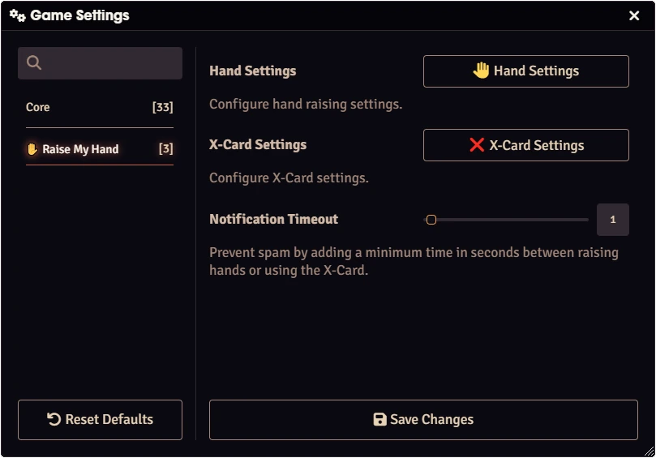
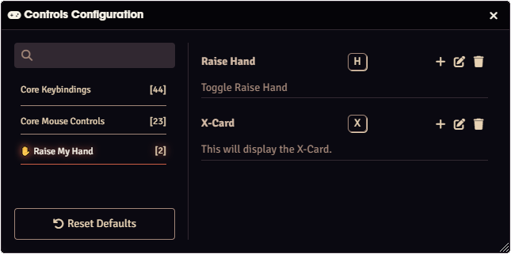

# ✋ Raise My Hand
This module impliments a simple and configurable way for a player to create a notification to the GM or all players at the table.
This is implimented as a "raise hand" action or an X-Card popout if enabled.

## Features
- Rich suit of configurable options
  - Place an icon in the Player List
  - Play a customizable sound
  - Display a configurable popout in the middle of the others canvases
  - A small UI notification along the top
  - Send a chat message
  - All have individual control of if the notification is sent to GMs or all players
- [X-Card by John Stavropoulos](https://docs.google.com/document/d/1SB0jsx34bWHZWbnNIVVuMjhDkrdFGo1_hSC2BWPlI3A/edit) with similar customization options to the Hand.
- Switch between notification that toggle or act as one-shots.
- Configurable Timeout for spam prevension.
- Configurable FoundryVTT keybinding.

## Raise my Hand Buttons
<div align="center">
  <video width="45%" autoplay loop muted playsinline style="margin: 0 1%;">
    <source src="github-assets/token-raise-hand.webm" type="video/webm">
  </video>
  <video width="45%" autoplay loop muted playsinline style="margin: 0 1%;">
    <source src="github-assets/token-xcard.webm" type="video/webm">
  </video>
</div>

## Main Settings
<div align="center">
  
</div>

## Keybindings
<div align="center">
  
</div>

## Localization
If you want to translate this module [DOWNLOAD THIS FILE](https://raw.githubusercontent.com/henry-malinowski/raise-my-hand-plus/main/lang/en.json) and translate it. 
After that open an issue sharing your translation. 

You also need to share with me the default name convention for your language. 
This is very easy to get. 
- Find a system or module which is translated to your language. 
- Open the **module.json** file.
- You should find something like the code above. It's under **languages**. Share with me **lang, name and path** for your language.
```json
{
  "lang": "en",
  "name": "English",
  "path": "lang/en.json"
},
{
  "lang": "fr",
  "name": "Français",
  "path": "lang/fr.json"
}  
```

## Community
- Do you found a bug? [Report it!](https://github.com/henry-malinowski/raise-my-hand-plus/issues)
- Do you want to send a translation? [Send it!](https://github.com/henry-malinowski/raise-my-hand-plus/issues)

# Acknowledgements
- [Mestre Digital](https://github.com/brunocalado) for maintaining this module over the years.
- [Cody Swendrowski](https://github.com/cswendrowski) for creating the [first version](https://github.com/cswendrowski/FoundryVTT-Raise-My-Hand) of this module.

# License
- Code: [LICENSE](https://github.com/henry-malinowski/raise-my-hand-plus/blob/main/LICENSE)
- Chime & X-Card warning sound: https://creativecommons.org/licenses/by/4.0/
